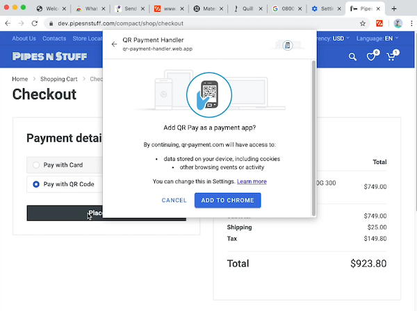

# A Vision for Web Payments Architecture: Payment Credentials, In-Context Display, and Streamlined Authentication

This is a draft for discussion, summarized by Ian Jacobs or Adrian Hope-Bailie. There is **No consensus** by browser vendors or others about this proposal.

## Introduction

One design goal of Payment Request API is to streamline checkout by making it easy for users to reuse stored payment credentials. In the past year the Web Payments Working Group has also turned its attention to the smooth integration of strong customer authentication (SCA) into Payment Request, notably using Web Authentication.

Through experience, experiments, and discussion we perceive that a small number of browser capabilities might help streamline checkout in a variety of flows. Through this document, we hope to build a shared vision of problem statements, flows, and browser capabilities. API (re-)design choices would be grounded in this shared vision.

## What problems are we solving

* Merchants seek to reduce friction in checkout as it can be a source of cart abandonment. Friction includes retyping information, inconsistent checkout experiences, multi-step processes, authentication friction, etc.
* One specific form of friction is redirecting the user to another site (e.g., to payment services or banks for authentication). Merchants do not like redirects because they lose control over the user experience and there is uncertainty about whether the user will return to the merchant context.
* We seek to reduce fraud risk and satisfy a growing set of regulatory requirements for strong customer authentication without introducing significant UX friction. Privacy changes in browsers (elimination of third party storage access, less fingerprinting) run the risk of requiring frequent logins across checkouts, and is likely to disrupt current risk assessment techniques used in the payment industry.

## Capabilities

We have identified three browser capabilities we believe could be used in combination to enhance a variety of checkout flows on the Web:

* Payment credential storage in the browser. **Note**: Payment credentials are not the same as Web Authentication credential identifiers.
* In-context display of payment provider information
* Streamlined authentication

These capabilities are represented in part by existing APIs: Payment Request, Payment Handler, Basic Card and Web Authentication. This is how we have learned about their value to various stakeholders. Some goals of the current document are:

* to more clearly identify valuable features (which might also lead us to strip out some other features and simplify the APIs);
* to generalize them, both to make them more useful across payment methods and to make them more interesting for browser vendors to implement;
* to find ways to improve the user experience by "coupling" capabilities more closely in a payments context than is possible when using other Web features "out of the box."

Here are some "use cases" that might use these capabilities differently:

|                     | In-Context Display |  Browser-stored payment credentials | Streamlined authentication | 
|---------------------|------|-----|-----|
| *Pay (one PMI)      | Payment App |     |    | 
| Form fill + 3DS     | Merchant (for OTP) |               |  Yes  |
| SRC via payment app | Payment App |               |  Maybe   | 
| SRC via browser     |  |     Yes              |  Yes  |
| PayPal in modal | Merchant |  | |
| PayPal static creds | |    Yes   | Yes |

Notes:

* "*Pay" refers to digital wallets such as Google Pay, Apple Pay, and Samsung Pay
* SRC refers to EMV&reg; Secure Remote Commerce
* For more information about "form fill + 3DS" see [Secure Payment Confirmation (SPC) proposal](https://github.com/rsolomakhin/secure-payment-confirmation).
* "PayPal static creds" does not refer to an actual deployment; only a shorthand for an origin (such as PayPal) storing information about user payment credentials for quick access.

### Payment Credential Storage in the Browser

From the start of our work we have discussed caching information to make it easy for users to pay across different sites. Indeed, one vision of Payment Request API was as an autofill enhancement.
However, the vision for what information would be most useful to store has evolved.

The current architecture envisions a "payment credential" class.

* An origin would register a payment credential in the browser. This origin is said to "control" the credential. The browser keeps track of which origin controls the payment credential. We envision a variety of use cases:
   * A digital wallet wishes to speed up checkout by registering some of the user's payment credentials in the browser.
   * A merchant may wish to register payment credentials associated with the user's account ("cards on file" for example) and leverage the streamlined authentication capability.
   * A bank may wish to register a payment credential (e.g., representing a bank account) when the user visits their bank Web site, and allow the user to reuse this credential easily in future transactions.
* During a transaction, the browser would display the list of registered payment credentials associated with the payment methods accepted by the merchant.

#### Payment credential class

The payment credential class has these properties:

* Payment Method. A payment method is (essentially) the class to which a payment credential belongs. This architecture leverages [Payment Method Identifiers](https://www.w3.org/TR/payment-method-id/).
* Display information. The browser displays this information &mdash;a string and icon&mdash; in a number of scenarios, such as showing the user available credentials, and when authenticating the use of a particular credential.
* Unique payment credential identifier. The meaning of this identifier depends on the payment method. The origin that controls the payment credential, for example, might use it to identify a specific bank account or credit card, or might use it to identifier a specific user. Ideally this identifier would be dereferenceable (that is, a URL), but it might not be dereferenced in all contexts (e.g., when used in a back end protocol). See below for privacy considerations. **Note**: The unique payment credential identifier is not the same as theWeb Authentication credential identifier.

#### Access to payment credentials

* The controlling origin can add and update controlled credentials in either a 1p context or in a payment context within the (3p) in-context display.
* All origins can access the credential selected by the user (returned through Payment Request). 

In addition we want to consider the following capabilities depending on payment method requirements:

* For lifecycle management, the controlling origin can enumerate controlled credentials in a 1p context.

#### Payment credential display and selection

When the merchant calls Payment Request API, the browser displays stored payment method credentials that match the payment method identifiers specified by the merchant. When the user selects a credential from the browser's list, the merchant receives the selected payment credential.

Note how the payment method information helps determine what happens next:

* Suppose the payment method identifier corresponds to a mobile wallet. The next step might involve invoking code from the origin associated with that wallet and feeding it the payment credential. That code might prompt the user to authenticate (see streamlined authentication below), or open a modal window for user interaction.
* Suppose the payment method identifier corresponds to "a credit card payment" or "a credit transfer." In this case, the merchant (or their PSP) might initiate backend protocols to determine what form of authentication (if any) is required. If authentication is required and possible through "streamlined authentication" they might leverage that capability.

For discussion:

* We would like to support the use cases where a "pay" button for a given payment method is displayed only when the user is ready to pay. The Working Group has addressed this through a hasEnrolledInstrument functionality, but continues to seek better privacy properties. 
* How can we ensure that the unique payment credential identifier is not used to track the user? We note that the identifier only needs to change once it has been used. Can browser ping server periodically to get fresh credentials or rotate identifiers?
* Does the merchant need to receive all data in the payment credential after selection?
* Could we have the browser generate the unique payment credential identifier, and add another field for routing it to the origin that controls the payment credential? That could help with privacy concerns.
* Can we use the [Credential Management API](https://developer.mozilla.org/en-US/docs/Web/API/Credential_Management_API) for the management of the payment credential? **Note**: This use of the Credential Management API would be distinct from the use of that API for persistent storage of an identifier for the user.

### In-context display of payment provider information

The Chrome implementation of Payment Handler API features a user experience with a number of interesting properties (see previous [blog post](https://www.w3.org/blog/wpwg/2019/10/29/payment-handler-value-proposition/): it keeps the user near the merchant context (instead of a redirect) and the browser displays the origin of the content at the top of a modal. Today only Web-based payment apps have access to this capability, but we have heard use cases where payment service providers (e.g., embedded in merchant pages) would like the same functionality.

For discussion:

* In light of this architecture, would 1p storage access still be needed?

### Streamlined Authentication

Increasingly, regulatory bodies are requiring "strong customer authentication (SCA)," including under PSD2 in Europe. However, friction in the user experience has complicated the deployment of SCA solutions. We believe that by combining Web APIs &mdash;in particular Web Authentication and Payment Request&mdash; we can provide a low-friction, standards-based solution for strong customer authentication.

At the current time, new capabilities for streamlined authentication are best represented by the [Secure Payment Confirmation (SPC) proposal](https://github.com/rsolomakhin/secure-payment-confirmation).

**Note:** In addition to discussion of low-friction authentication, the Web Payments Working Group remains interested in discussion of "zero-friction risk assessment" (as used today in EMV&reg; 3-D Secure 2). As browsers improve user privacy by limiting third party storage access and reducing the ability to fingerprint browser, some current risk assessment techniques are likely to become less effective. We continue to discuss alternatives within the Working Group, but those discussions are currently out of scope for the current document.

# Security and Privacy Considerations

## Expiration

* Should credentials have an expiration date?

## Leveraging the Payment Credential Origin

We have heard multiple ideas for leveraging the fact that a payment credential is associated with an origin:

* **Cookie replacement**. On several occasions we have discussed the idea of providing an origin with particular powers when in a known payment context (e.g., in the middle of a Payment Request call). We could make payment credentials clearable by the user, but with more user interaction required than generic cookies.
* **Gating the in-context display**. The browser could limit the use of in-context display capability to (1) a payment request context and (2) only code from the same origin as the payment credential selected by the user.

# General Considerations

* How do these capabilities relate to other browser capabilities (e.g., Chrome "touch to fill")

# FAQ

## How do Payment Apps fit into this vision?

As is the case today, browsers can handle registration requests from payment apps (native or Web-based). After user selection of a payment credential, the browser can either return the credential to the merchant, or launch a payment app to handle the credential. The payment app should be able to invoke streamlined authentication in a manner similar to the merchant.

For discussion:

* How would browsers choose between returning a selected payment credential to the merchant or to a payment app?

# Resources

* [Modal Window proposal](https://github.com/adrianhopebailie/modal-window/blob/master/explainer.md).
* [Minimal UI](https://github.com/w3c/webauthn-pay/blob/gh-pages/proposals/pr-webauthn-txconf.md)